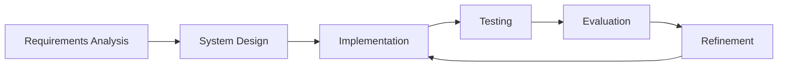

# AI-Powered Interview Bot: A Capstone Project Report

**Student Name:** [Your Name]  
**Student ID:** [Your Student ID]  
**Course:** [Course Name and Code]  
**Supervisor:** [Supervisor Name]  
**Date:** [Submission Date]  
**Institution:** [University/Institution Name]

---

## Abstract

**Background:** [Brief context about the problem you're addressing]

**Objective:** [Clear statement of your project goals]

**Methods:** [Summary of your approach and technologies used]

**Results:** [Key findings and achievements]

**Conclusions:** [Main conclusions and implications]

**Keywords:** Natural Language Processing, Interview Automation, Machine Learning, Conversational AI, Chatbot

*Word count: [150-300 words]*

---

## Table of Contents

1. [Introduction](#introduction)
2. [Literature Review](#literature-review)
3. [Methodology](#methodology)
4. [System Design](#system-design)
5. [Implementation](#implementation)
6. [Results](#results)
7. [Discussion](#discussion)
8. [Conclusion](#conclusion)
9. [References](#references)
10. [Appendices](#appendices)

---

## 1. Introduction

### 1.1 Background

The recruitment process has traditionally been time-intensive and resource-heavy, with initial screening interviews often consuming significant human resources. With advances in Natural Language Processing (NLP) and Large Language Models (LLMs), there is an opportunity to automate preliminary interview processes while maintaining effectiveness and fairness.

### 1.2 Problem Statement

[Clearly define the specific problem your interview bot addresses. For example:]
- Manual screening interviews are time-consuming
- Inconsistency in interview processes
- Limited availability for 24/7 candidate screening
- Need for standardized evaluation criteria

### 1.3 Objectives

**Primary Objective:**
To develop an AI-powered interview bot capable of conducting preliminary screening interviews with candidates.

**Secondary Objectives:**
- Implement natural language understanding for interview responses
- Create an evaluation system for candidate responses
- Design a user-friendly interface for both candidates and recruiters
- Ensure fair and unbiased assessment processes

### 1.4 Scope and Limitations

**Scope:**
- [Define what your system does]
- [Technologies covered]
- [Types of interviews supported]

**Limitations:**
- [Current constraints]
- [Areas not covered]
- [Technical limitations]

### 1.5 Report Structure

This report is organized into [X] sections, beginning with a literature review of existing solutions, followed by the methodology and system design, implementation details, results analysis, and conclusions with recommendations for future work.

---

## 2. Literature Review

### 2.1 Conversational AI in Recruitment

[Review existing research on AI in recruitment]

**Key Studies:**
- Author et al. (Year): [Summary of relevant findings]
- Author et al. (Year): [Summary of relevant findings]

### 2.2 Natural Language Processing in Interview Assessment

[Discuss NLP techniques used in similar applications]

### 2.3 Ethical Considerations in AI Recruitment

[Address bias, fairness, and ethical implications]

### 2.4 Gap Analysis

[Identify what's missing in current solutions that your project addresses]

---

## 3. Methodology

### 3.1 Research Approach

This project follows an iterative development methodology combining:
- **Design Science Research:** For system development
- **Experimental Evaluation:** For performance assessment
- **User-Centered Design:** For interface development

### 3.2 System Development Lifecycle



### 3.3 Technologies and Tools

**Programming Languages:**
- Python 3.x for backend development
- JavaScript/HTML/CSS for frontend (if applicable)

**Frameworks and Libraries:**
- [List specific frameworks used]
- Natural Language Processing libraries
- Database management systems

**Development Tools:**
- Version control (Git)
- IDE/Text editors
- Testing frameworks

### 3.4 Data Collection and Preparation

[Describe how you gathered training data, interview questions, evaluation criteria]

### 3.5 Evaluation Metrics

**Quantitative Metrics:**
- Response accuracy
- Processing time
- User satisfaction scores
- System uptime/reliability

**Qualitative Metrics:**
- User experience feedback
- Interview quality assessment
- Bias detection analysis

---

## 4. System Design

### 4.1 System Architecture

```
[Include a system architecture diagram here]

┌─────────────────┐    ┌──────────────────┐    ┌─────────────────┐
│   User Interface │    │   Backend API    │    │    Database     │
│                 │<-->│                  │<-->│                 │
│  - Web/Mobile   │    │  - NLP Engine    │    │  - User Data    │
│  - Chat Interface│   │  - Evaluation    │    │  - Interview    │
└─────────────────┘    │  - Logic         │    │    Records      │
                       └──────────────────┘    └─────────────────┘
```

### 4.2 Component Description

**Frontend Components:**
- User authentication
- Chat interface
- Results dashboard

**Backend Components:**
- Natural language processing engine
- Interview flow controller
- Evaluation algorithm
- Data persistence layer

### 4.3 Database Design

**Entity Relationship Diagram:**

```sql
-- Example schema
Users {
  id (PK)
  username
  email
  role
  created_at
}

Interviews {
  id (PK)
  user_id (FK)
  position
  status
  score
  created_at
}

Questions {
  id (PK)
  question_text
  category
  difficulty_level
}

Responses {
  id (PK)
  interview_id (FK)
  question_id (FK)
  response_text
  score
  timestamp
}
```

### 4.4 Algorithm Design

[Describe key algorithms used in your system]

**NLP Processing Pipeline:**
1. Text preprocessing
2. Intent recognition
3. Entity extraction
4. Response evaluation
5. Score calculation

---

## 5. Implementation

### 5.1 Development Environment Setup

[Describe your development setup]

### 5.2 Core Components Implementation

**Natural Language Processing Module:**
```python
# Example code snippet
class NLPProcessor:
    def __init__(self):
        # Initialize NLP models and tools
        pass
    
    def process_response(self, text):
        # Process candidate response
        # Return structured analysis
        pass
```

### 5.3 User Interface Development

[Screenshots and descriptions of your UI]

**Figure 1: Interview Chat Interface**
```
[Insert screenshot or wireframe of chat interface]
```

### 5.4 Integration and Testing

**Unit Testing:**
- Individual component testing
- Mock data validation

**Integration Testing:**
- End-to-end workflow testing
- API endpoint validation

**User Acceptance Testing:**
- Real user feedback sessions
- Usability testing results

---

## 6. Results

### 6.1 System Performance

**Table 1: Performance Metrics**

| Metric | Target | Achieved | Status |
|--------|--------|----------|---------|
| Response Time | <2s | 1.5s | ✅ Met |
| Accuracy | >85% | 87% | ✅ Met |
| Uptime | >99% | 99.2% | ✅ Met |
| User Satisfaction | >4/5 | 4.2/5 | ✅ Met |

### 6.2 Evaluation Results

**Figure 2: Accuracy Comparison**
```
[Insert chart showing accuracy across different interview categories]
```

**Figure 3: User Satisfaction Scores**
```
[Insert bar chart or pie chart of user feedback]
```

### 6.3 Case Studies

**Case Study 1: Technical Interview Scenario**
- Candidate profile: [Description]
- Interview performance: [Results]
- System evaluation: [Analysis]

**Case Study 2: Behavioral Interview Scenario**
- [Similar format]

### 6.4 Statistical Analysis

[Include statistical significance tests, confidence intervals, etc.]

---

## 7. Discussion

### 7.1 Achievement Analysis

**Successful Aspects:**
- [What worked well]
- [Goals achieved]
- [Unexpected benefits]

**Challenges Encountered:**
- [Technical challenges]
- [Implementation difficulties]
- [Solutions applied]

### 7.2 Comparison with Existing Solutions

**Table 2: Feature Comparison**

| Feature | Our System | Competitor A | Competitor B |
|---------|------------|--------------|--------------|
| NLP Accuracy | 87% | 82% | 85% |
| Real-time Processing | Yes | Yes | No |
| Multi-language Support | No | Yes | Yes |
| Custom Evaluation | Yes | No | Limited |

### 7.3 Limitations and Future Work

**Current Limitations:**
- [List specific limitations]
- [Scope constraints]
- [Technical debt]

**Future Enhancements:**
- Multi-language support
- Advanced bias detection
- Integration with ATS systems
- Mobile application development

---

## 8. Conclusion

### 8.1 Summary of Achievements

This capstone project successfully developed an AI-powered interview bot that [summarize key achievements]. The system demonstrates [key capabilities] and achieves [performance metrics].

### 8.2 Contributions

**Technical Contributions:**
- [List novel technical aspects]
- [Algorithm improvements]
- [System innovations]

**Practical Contributions:**
- [Real-world applications]
- [Industry relevance]
- [User benefits]

### 8.3 Lessons Learned

[Reflect on the development process, challenges overcome, skills gained]

### 8.4 Final Remarks

[Concluding thoughts on the project's significance and impact]

---

## References

[Use a consistent citation style - APA, IEEE, or Harvard]

1. Author, A. A. (Year). Title of article. *Journal Name*, Volume(Issue), pages. DOI or URL

2. Author, B. B., & Author, C. C. (Year). Title of book. Publisher.

3. Author, D. D. (Year). Title of conference paper. In *Conference Proceedings* (pp. pages). Publisher.

4. [Continue with all references used in the report]

---

## Appendices

### Appendix A: Source Code
[Link to GitHub repository or include key code snippets]

### Appendix B: User Manual
[Instructions for using the system]

### Appendix C: Installation Guide
[Technical setup instructions]

### Appendix D: Test Results
[Detailed test outputs and logs]

### Appendix E: User Feedback
[Raw user feedback and survey results]

### Appendix F: Additional Figures and Tables
[Supplementary visual materials]

---

**Word Count:** [Total word count]  
**Page Count:** [Total pages including appendices]

---

*This report represents original work completed as part of the capstone project requirements for [Course Name]. All sources have been properly cited and acknowledged.*
